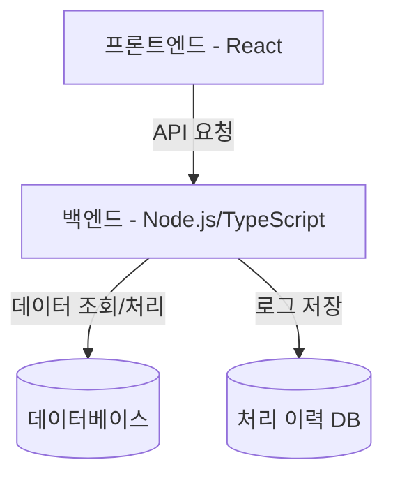
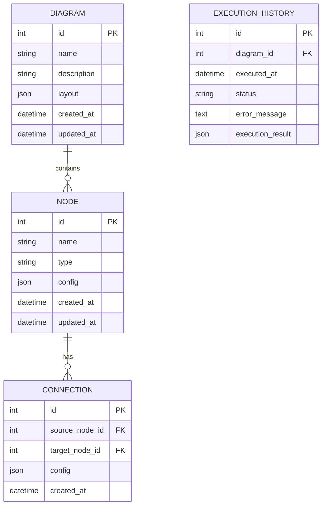
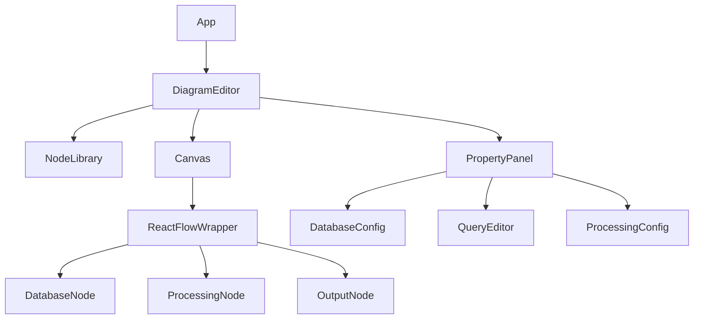
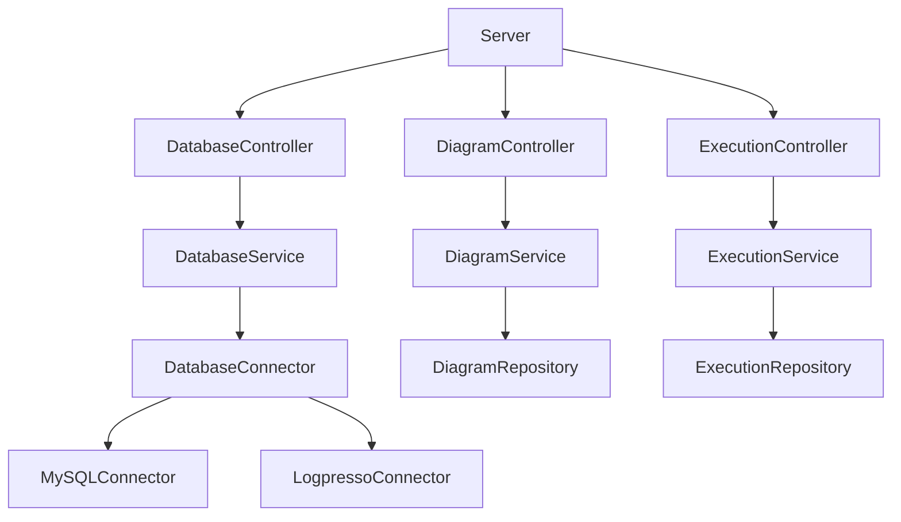
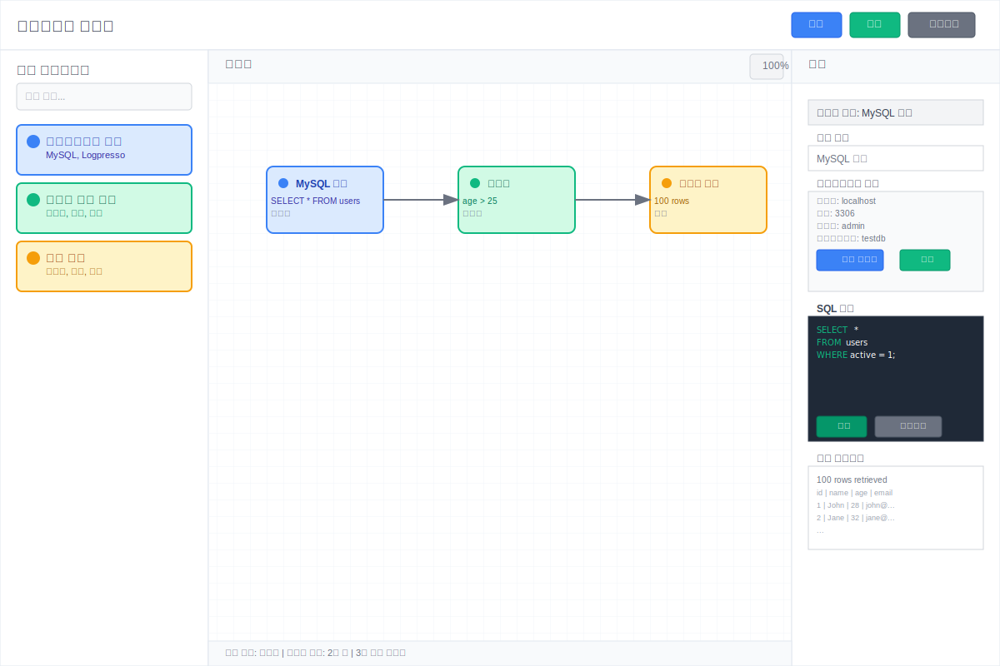

# 다이어그램 기반 데이터 처리 시스템 설계서

## 1. 시스템 아키텍처

### 1.1 전체 아키텍처


### 1.2 기술 스택
- **프론트엔드**
  - React.js
  - TypeScript
  - React Flow (다이어그램 라이브러리)
  - Tailwind CSS (스타일링)
  - Redux Toolkit (상태관리)

- **백엔드**
  - Node.js
  - TypeScript
  - Express.js
  - TypeORM (데이터베이스 ORM)

- **데이터베이스**
  - MySQL (메인 데이터베이스)
  - Logpresso (로그 데이터)

## 2. 데이터베이스 설계

### 2.1 ERD


### 2.2 테이블 상세 설계

#### DIAGRAM 테이블
- 다이어그램 메타데이터 저장
- layout: React Flow 노드 위치 및 스타일 정보

#### NODE 테이블
- 개별 노드 정보 저장
- type: 'database', 'processing', 'output'
- config: 노드별 설정 (JSON 형태)

#### CONNECTION 테이블
- 노드 간 연결 정보
- 데이터 흐름 정의

#### EXECUTION_HISTORY 테이블
- 다이어그램 실행 이력
- 에러 로그 및 결과 저장

## 3. 컴포넌트 설계

### 3.1 프론트엔드 컴포넌트 구조


### 3.2 백엔드 모듈 구조


## 4. API 설계

### 4.1 다이어그램 관리 API
```
POST /api/diagrams
- 새 다이어그램 생성
- Body: { name, description, layout }

GET /api/diagrams
- 다이어그램 목록 조회
- Query: page, limit

GET /api/diagrams/:id
- 특정 다이어그램 조회
- Response: 다이어그램 상세 정보 + 노드 + 연결

PUT /api/diagrams/:id
- 다이어그램 수정
- Body: { name, description, layout }

DELETE /api/diagrams/:id
- 다이어그램 삭제
```

### 4.2 데이터베이스 연동 API
```
POST /api/database/connect
- DB 연결 테스트
- Body: { type, host, port, username, password, database }

POST /api/database/query
- 쿼리 실행
- Body: { connectionConfig, query }

GET /api/database/tables
- 테이블 목록 조회
- Query: connectionConfig
```

### 4.3 실행 엔진 API
```
POST /api/executions/start
- 다이어그램 실행
- Body: { diagramId }

GET /api/executions
- 실행 이력 조회
- Query: diagramId, page, limit

GET /api/executions/:id
- 특정 실행 상세 조회
```

## 5. UI 설계

### 5.1 데스크톱 와이어프레임



### 5.2 UI 컴포넌트 명세

#### 헤더 컴포넌트
- 애플리케이션 타이틀
- 저장/불러오기 버튼
- 실행 버튼

#### 노드 라이브러리 패널
- 드래그 가능한 노드 템플릿
- 노드 타입별 분류
- 검색 기능

#### 메인 캔버스
- React Flow 기반
- 그리드 배경
- 줌/팬 기능
- 미니맵

#### 속성 패널
- 선택된 노드의 설정 UI
- 동적 폼 렌더링
- 실시간 유효성 검사

## 6. 노드 타입 설계

### 6.1 데이터베이스 노드
```typescript
interface DatabaseNodeConfig {
  type: 'mysql' | 'logpresso';
  connection: {
    host: string;
    port: number;
    username: string;
    password: string;
    database: string;
  };
  query: string;
}
```

### 6.2 처리 노드
```typescript
interface ProcessingNodeConfig {
  type: 'filter' | 'aggregate' | 'transform';
  rules: {
    filter?: FilterRule[];
    aggregate?: AggregateRule[];
    transform?: TransformRule[];
  };
}
```

### 6.3 출력 노드
```typescript
interface OutputNodeConfig {
  type: 'table' | 'chart' | 'file';
  format: string;
  options: Record<string, any>;
}
```

## 7. 상태 관리 설계

### 7.1 Redux Store 구조
```typescript
interface AppState {
  diagram: {
    current: Diagram | null;
    nodes: Node[];
    edges: Edge[];
    selectedNode: string | null;
  };
  execution: {
    isRunning: boolean;
    results: ExecutionResult[];
    errors: Error[];
  };
  ui: {
    selectedPanel: 'properties' | 'results';
    zoom: number;
    viewport: Viewport;
  };
}
```

## 8. 구현 계획

### 8.1 1단계 (MVP) - 4주
1. **주 1-2: 기본 UI 구성**
   - React 프로젝트 설정
   - 기본 레이아웃 구현
   - React Flow 통합

2. **주 3-4: MySQL 연동**
   - 백엔드 API 구현
   - 데이터베이스 연결 기능
   - 기본 쿼리 실행

### 8.2 2단계 - 6주
1. **주 5-6: 노드 시스템**
   - 노드 타입 구현
   - 드래그 앤 드롭
   - 속성 패널

2. **주 7-8: 데이터 처리**
   - 필터링 기능
   - 집계 기능
   - 변환 기능

3. **주 9-10: Logpresso 연동**
   - Logpresso 커넥터 구현
   - 통합 테스트

### 8.3 3단계 - 4주
1. **주 11-12: 고급 기능**
   - 실시간 처리
   - 파이썬 코드 노드
   - 성능 최적화

2. **주 13-14: 완성도 향상**
   - UI/UX 개선
   - 에러 처리
   - 문서화

## 9. 테스트 전략

### 9.1 단위 테스트 (TDD 적용)
- 코어 비즈니스 로직
- 데이터베이스 연결 모듈
- 쿼리 실행 엔진
- 데이터 처리 알고리즘

### 9.2 통합 테스트
- API 엔드포인트
- 데이터베이스 연동
- 전체 실행 플로우

### 9.3 E2E 테스트
- 사용자 시나리오
- 브라우저 호환성
- 성능 테스트

## 10. 보안 및 성능 고려사항

### 10.1 보안
- 데이터베이스 연결 정보 암호화
- SQL 인젝션 방지
- 입력 데이터 검증
- 접근 로그 기록

### 10.2 성능
- 쿼리 실행 시간 제한
- 결과 데이터 페이징
- 메모리 사용량 모니터링
- 캐싱 전략

## 11. 참고사항

- 코어 비즈니스 로직은 TDD 방식으로 구현
- 실시간 데이터 처리 필요
- 데이터 처리 이력 저장 필수
- 향후 파이썬 코드 적용 확장 예정 